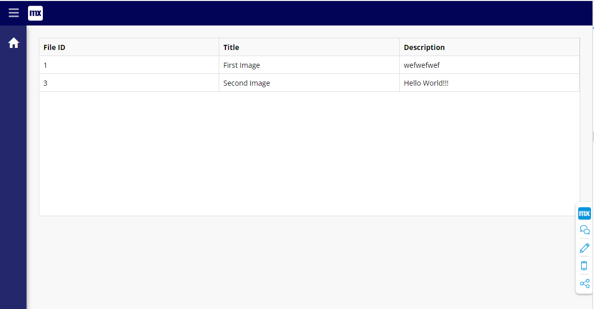
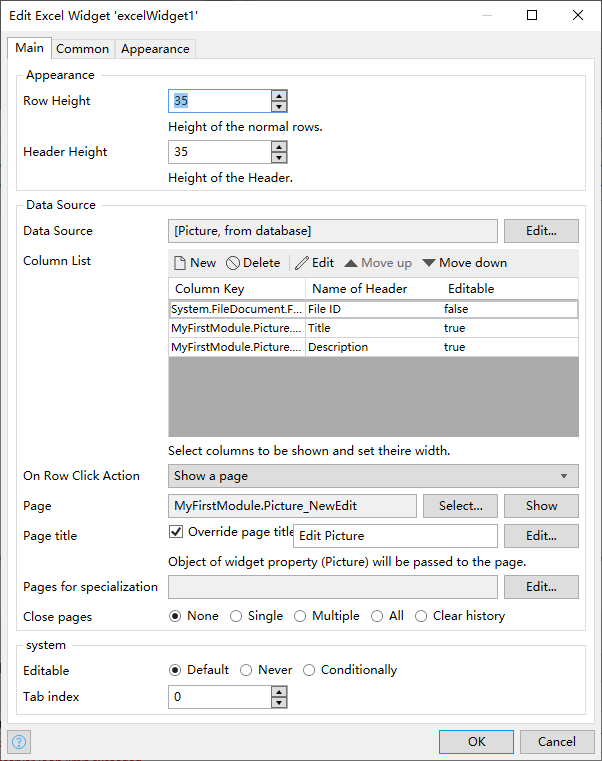

## ExcelWidget
A Mendix pluggable widget to show and edit `Entity`s from `Domain Model`.

It looks like this: 

## Features

1. You can set `headerHeight` and `rowHeight` of the table.
2. You can set `datasource` and `columns` to show on the table.
3. You can set `On Row Click Action` to do something with the row when clicked.

## Development and contribution

1. Install NPM package dependencies by using: `npm install`. If you use NPM v7.x.x, which can be checked by executing `npm -v`, execute: `npm install --legacy-peer-deps`.
1. Run `npm start` to watch for code changes. On every change:
    - the widget will be bundled;
    - the bundle will be included in a `dist` folder in the root directory of the project;
    - the bundle will be included in the `deployment` and `widgets` folder of the Mendix test project.

[specify contribution]
